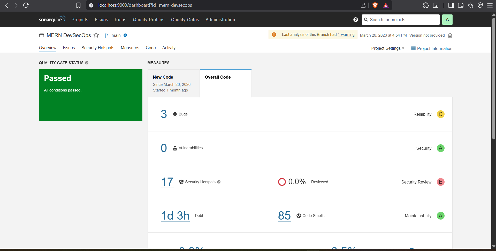
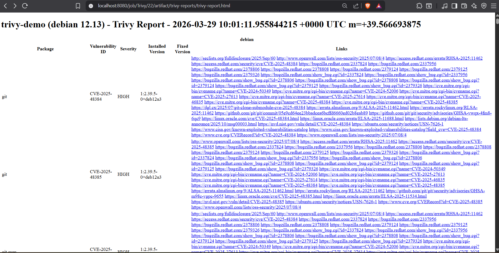

# 🔐 DevSecOps Security Pipeline | Jenkins + SonarQube + Trivy + Docker


---

## 📌 Overview

This project demonstrates **two independent Jenkins CI/CD pipelines** built for better understanding of DevSecOps security tools — one focused on **SonarQube** (code quality & static analysis) and one focused on **Trivy** (container image vulnerability scanning).

> ⚠️ Cloud infrastructure intentionally deprovisioned 
> post-testing to optimize costs — a real-world 
> FinOps practice. All pipeline configs, Jenkinsfiles, 
> and output screenshots are preserved in this repo.

---

## 🏗️ Pipeline 1 — SonarQube (Code Quality & SAST)

```
Developer pushes code
        ↓
Jenkins Pipeline triggers
        ↓
SonarQube Static Code Analysis
(bugs, code smells, security vulnerabilities)
        ↓
Quality Gate Check
        ↓
✅ Pass → Pipeline Success
🚫 Fail → Pipeline Blocked
```

## 🏗️ Pipeline 2 — Trivy (Container Image Security)

```
Developer pushes code
        ↓
Jenkins Pipeline triggers
        ↓
Docker Image Build
        ↓
Trivy Image Scan
(HIGH & CRITICAL vulnerability detection)
        ↓
Security Gate Check
        ↓
✅ Clean image → Delivered
🚫 HIGH/CRITICAL found → Pipeline FAILS & Blocked
```

---

## ⚙️ Tech Stack

| Category | Tools |
|---|---|
| CI/CD | Jenkins |
| Code Quality & SAST | SonarQube |
| Container Security Scanning | Trivy |
| Containerization | Docker |
| Version Control | Git |

---

## 🎯 What Was Implemented

**Pipeline 1 — SonarQube:**
- ✅ Jenkins pipeline integrated with **SonarQube** for automated static code analysis
- ✅ Detects bugs, code smells, and security vulnerabilities in source code
- ✅ **Quality Gate** enforced — pipeline blocks if code does not meet standards

**Pipeline 2 — Trivy:**
- ✅ Jenkins pipeline builds Docker image and runs **Trivy vulnerability scan**
- ✅ Scans for **HIGH and CRITICAL** CVEs in container image layers
- ✅ **Security Gate enforced** — build blocked automatically on HIGH/CRITICAL findings
- ✅ Demonstrated both failure (vulnerable image) and success (clean image) scenarios

---

## 📸 Screenshots

### 🔵 Pipeline 1 — SonarQube

#### ✅ Pipeline Success


#### 📈 SonarQube Dashboard


#### 📝 Success Logs


---

### 🔴 Pipeline 2 — Trivy

#### 🚫 Pipeline Failed (HIGH/CRITICAL Vulnerabilities Detected)


#### 🛡️ Security Gate Blocking Build


#### 📋 Vulnerability Report


#### 📊 Vulnerability Table


---

## 📂 Repository Structure

```
DevSecOps/
├── Trivy/
│   └── OutPut/
│       ├── Failed Pipeline.png
│       ├── Report.png
│       ├── Security Gate.png
│       └── Table of vul.png
├── SonarQube/
│   └── OutPut/
│       ├── Dashboard.png
│       ├── Success logs.png
│       └── success pipeline.png
└── README.md
```

---

## 🧠 Challenges Faced & Solved

| Challenge | Solution |
|---|---|
| SonarQube not connecting to Jenkins | Configured SonarQube token in Jenkins credentials manager |
| Trivy not blocking pipeline on HIGH findings | Added `--exit-code 1` flag to Trivy scan command |

---

## 💡 Key DevSecOps Concepts Demonstrated

- **Shift-Left Security** — security checks happen early in pipeline, not after deployment
- **Security as Code** — vulnerability thresholds enforced automatically, no manual checks
- **Quality Gates** — code cannot proceed if it fails SonarQube or Trivy standards
- **Fail Fast** — pipeline stops immediately on HIGH/CRITICAL findings

---

## 🔁 How to Reproduce

```bash
# Pipeline 1 — SonarQube Setup
docker run -d -p 8080:8080 jenkins/jenkins:lts
docker run -d -p 9000:9000 sonarqube:community
# Configure SonarQube token in Jenkins → Create pipeline → Run

# Pipeline 2 — Trivy Setup
docker run -d -p 8080:8080 jenkins/jenkins:lts
# Install Trivy on Jenkins server
# Create pipeline with Docker build + Trivy scan stage
trivy image --exit-code 1 --severity HIGH,CRITICAL image:tag
```

---

## 👨‍💻 Author

**Sujal Shaha** | [LinkedIn Profile](https://www.linkedin.com/in/sujal-shaha-15832b286/) | [GitHub](https://github.com/sujal-07-Ronny)

🏅 AWS Certified Cloud Practitioner (CLF-C02)
